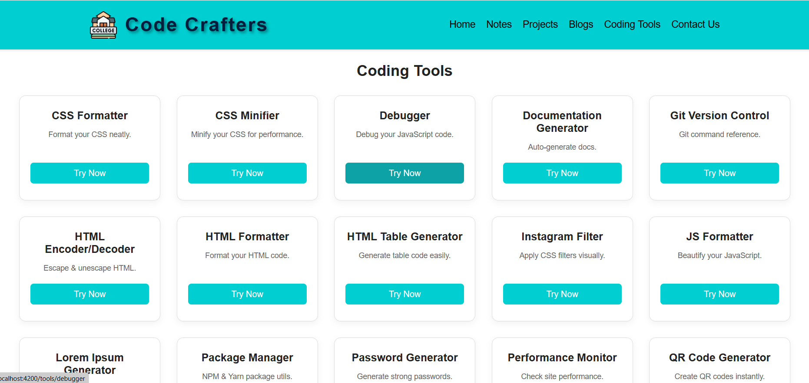

# 🎓 CampusCorner

**CampusCorner** is a responsive web app built for college students to access free learning resources, coding tools, and productivity utilities — all in one place.



---

## 🚀 Features

- 📚 Download notes, previous question papers, and learning material
- 💻 Built-in coding tools like formatters, slug generators, tree viewers, etc.
- 📱 Fully responsive for mobile and desktop
- 🎨 Modern UI with custom themes and animations
- 🔍 Easy navigation and organized layout

---

## 🛠 Tech Stack

- **Frontend:** HTML, CSS, JavaScript
- **Framework:** Angular
- **Tools:** GitHub Pages, MIT License

---

## 📸 Screenshots

| Home Page | Tools Panel |
|-----------|-------------|
|  |  |

---

## 📦 Folder Structure

```bash
campus-corner/
├── src/
├── assets/
├── index.html
├── styles.css
├── script.js
├── README.md
├── LICENSE
└── .gitignore
